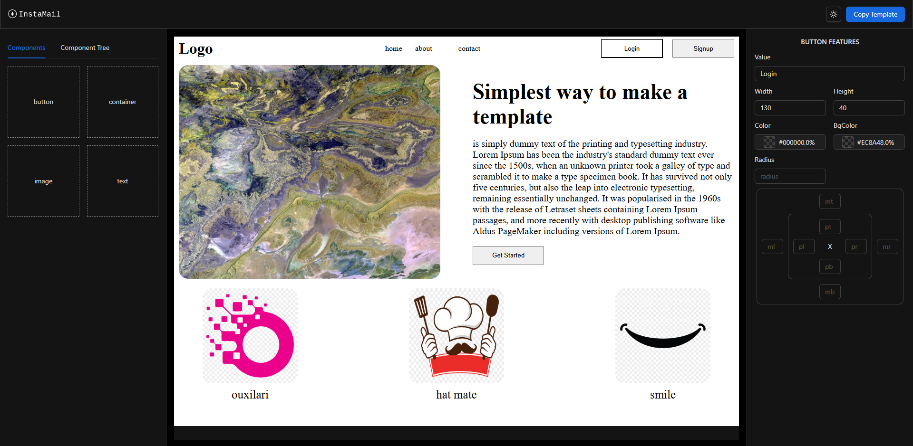

# InstaMail

InstaMail is a web application that enables users to create email templates quickly and efficiently. Whether you need to design a marketing email, a newsletter, or a simple transactional email, InstaMail streamlines the process, offering a user-friendly interface and a variety of customization options.

## Features

- **Drag and Drop Editor:** Easily customize your email templates with a drag-and-drop interface.
- **Responsive Design:** Ensure your emails look great on any device with built-in responsive design tools.
- **Customizable Components:** Personalize your templates with custom text, images, buttons, and more.
- **Live Preview:** See how your email will appear on different devices in real-time.
- **Export Options:** Export your email templates in HTML format, ready to be sent through your email service provider.

## Installation

To get started with InstaEmail, follow these steps:

### Prerequisites

- Node.js (v14 or higher)
- npm (v6 or higher) or Yarn

### Clone the Repository

```bash
git clone https://github.com/yofthae1/InstaEmail.git
cd InstaEmail
